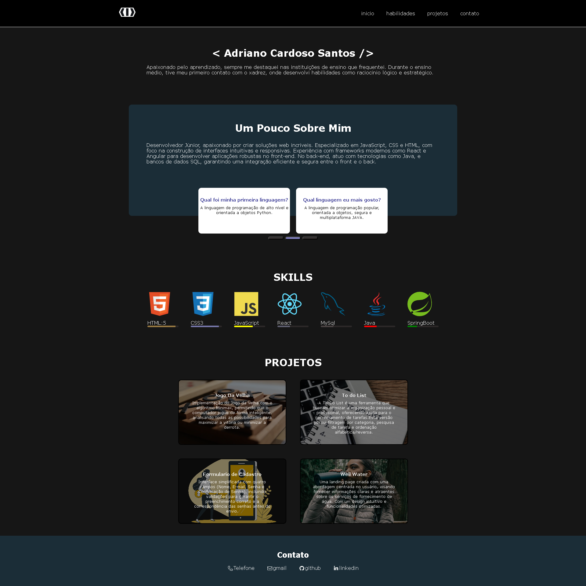

<a id="readme-top"></a>
# Portifolio:
Um portfólio simples que apresenta informações básicas sobre mim e direciona para meus outros projetos.

## Estrutura do projeto: 
 - **Menu:** Com posição fixa, o menu contém links em cada um de seus itens, que direcionam para diferentes seções do portfólio.
 - **Introdução:** Seção com algumas informações básicas sobre mim, complementada por cartões com curiosidades e respostas que eu mesmo elaborei.
 - **Skills:** Apresenta minhas habilidades por meio de logos, com o nível de proficiência indicado abaixo de cada uma.
 - **Projetos:** Seção que apresenta cartões com uma breve descrição de cada projeto. Cada cartão é clicável e redireciona para um projeto diferente.
 - **Rodapé:** contém links que direcionam para minhas informações de contato, incluindo telefone, e-mail (Gmail), GitHub e LinkedIn.

## Imagem do portofio:



## :octocat: Faça o clone do projeto

```bash
# Clone este repositório
$ gh repo clone Adriano047/RepositorioAds

# Acesse a pasta do projeto no terminal/cmd
$ cd me

```


## 👨‍🔧 Sobre mim
"Conecte-se comigo no LinkedIn para explorar minha trajetória profissional e colaborar em projetos incríveis."
<table>
  <tbody>
    <tr>
      <td align="center" valign="top" width="14.28%"><a href="https://www.linkedin.com/in/cardosodev047/"><br /><sub><b>Adriano Cardoso Santos</b></sub></a><br />
    </tr>
  </tbody>
</table>

<p align="right">(<a href="#readme-top">Voltar ao topo</a>)</p>

